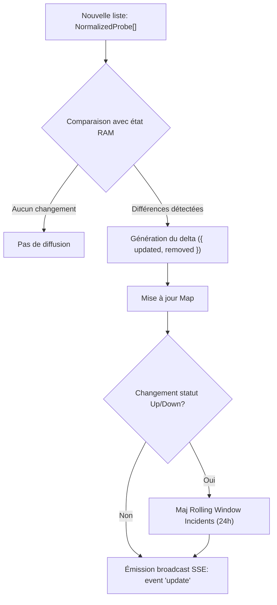
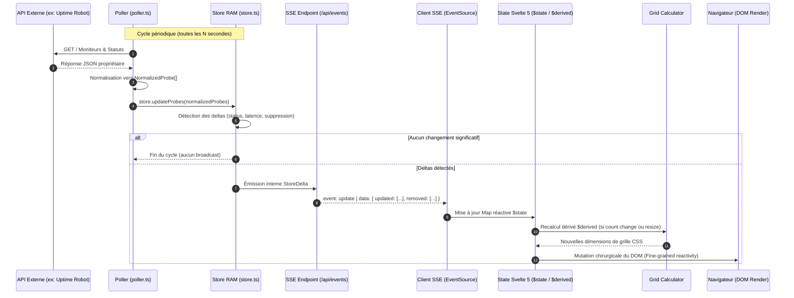
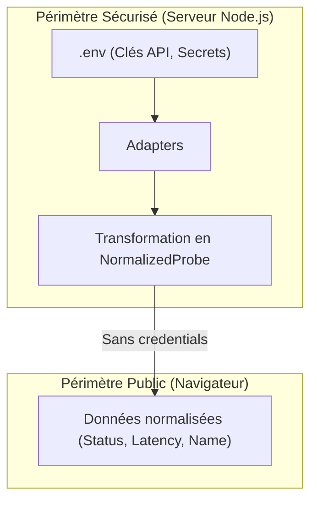

# Architecture Kato

Ce document constitue la référence technique et architecturale du projet **Kato Dashboard**. Il détaille les principes d'ingénierie, les flux de données, les contrats TypeScript et les patterns d'implémentation destinés au développement sous SvelteKit 2 et Svelte 5.

---

## 1. Vue d'ensemble

Kato est un tableau de bord de supervision (NOC / Wallboard) ultra-haute densité, conçu pour fonctionner en affichage continu sur écran mural ou poste opérateur sans aucune interaction utilisateur requise.

### Principes directeurs

| Critère | Spécification | Rationale technique |
| :--- | :--- | :--- |
| **Densité** | 1 à 200+ sondes en vue unique | **Zéro scroll** horizontal ou vertical. La disposition s'adapte automatiquement à l'espace écran (`100vw` / `100vh`). |
| **Framework** | [SvelteKit](https://kit.svelte.dev/) (Svelte 5 Runes) | Compilateur réactif haute performance, empreinte mémoire minimale, SSR/BFF natif via Node.js. |
| **Runtime** | `@sveltejs/adapter-node` | Serveur Node.js autonome persistant requis pour maintenir les connexions SSE et le poller mémoire. |
| **Style & UI** | Tailwind CSS v4 + PostCSS | Système utilitaire moderne sans fichier de config JS lourd, optimisé pour les micro-cellules CSS Grid/Flexbox. |
| **Typage** | TypeScript strict | Typage complet du backend (BFF) au frontend sans duplication (`types/index.ts`). |
| **Temps réel** | Server-Sent Events (SSE) | Flux unidirectionnel HTTP standardisé (`text/event-stream`), ré-établissement automatique natif via `EventSource`. |
| **Persistance** | **100% In-Memory (RAM)** | Aucune base de données SQL/NoSQL requise. L'état canonique réside en mémoire et se reconstruit au boot par polling. |

---

## 2. Architecture en couches

Le système repose sur un pattern **BFF (Backend-For-Frontend)** intégré au serveur SvelteKit. Il découple complètement les APIs tierces de monitoring de l'interface utilisateur.

```
[APIs externes] ──(HTTP Polling)──> [BFF SvelteKit (server)] ──(SSE Stream)──> [Client Svelte 5] ──> [DOM / Navigateur]
```

```mermaid
flowchart LR
    subgraph External["Sources externes"]
        API1["Uptime Robot API"]
        API2["HetrixTools API"]
        Mock["Mock Generator"]
    end

    subgraph Server["SvelteKit BFF (Node.js runtime)"]
        Adapter["Couche 1: MonitoringAdapter"]
        Poller["Couche 3: Poller Service"]
        Store["Couche 2: In-Memory Store (RAM)"]
        SSE["Couche 4: Endpoint SSE (/api/events)"]
        
        Poller -->|Fetch régulier| Adapter
        Adapter -->|NormalizedProbe[]| Store
        Store -->|Deltas & Snapshots| SSE
    end

    subgraph Client["Frontend Client (Navigateur)"]
        SSEClient["SSE Client (EventSource)"]
        RunesState["Svelte 5 Runes ($state)"]
        GridCalc["Grid Calculator"]
        UI["Couche 5: Composants UI (ProbeGrid)"]

        SSE -->|text/event-stream| SSEClient
        SSEClient -->|Deltas| RunesState
        RunesState --> GridCalc
        GridCalc --> UI
    end

    API1 -.-> Adapter
    API2 -.-> Adapter
    Mock -.-> Adapter
```

---

### Couche 1 : Adapters (server-side)

*Emplacement source :* [`src/lib/server/adapters/`](file:///var/www-jeremy/projets/kato-dashboard/src/lib/server/adapters/)

La couche Adapter applique le **Pattern Adapter** classique. Elle isole le format spécifique des APIs de monitoring tierces et garantit au reste de l'application un contrat de données strict et immuable.

#### Contrats d'interface ([`adapter.interface.ts`](file:///var/www-jeremy/projets/kato-dashboard/src/lib/server/adapters/adapter.interface.ts))

```typescript
// src/lib/server/adapters/adapter.interface.ts
import type { NormalizedProbe, NormalizedIncident } from '$lib/types';

export interface MonitoringAdapter {
  /** Nom identifiant l'adaptateur (ex: 'uptimerobot', 'hetrix', 'mock') */
  readonly id: string;
  readonly name: string;

  /** Initialisation de l'adaptateur (validation des credentials, etc.) */
  init(): Promise<void>;

  /** Récupération complète des sondes normalisées */
  fetchProbes(): Promise<NormalizedProbe[]>;

  /** Récupération optionnelle des incidents récents */
  fetchIncidents?(): Promise<NormalizedIncident[]>;
}
```

#### Modèles de données normalisés ([`src/lib/types/index.ts`](file:///var/www-jeremy/projets/kato-dashboard/src/lib/types/index.ts))

```typescript
export type ProbeStatus = 'up' | 'down' | 'degraded' | 'paused' | 'unknown';

export interface NormalizedProbe {
  id: string;                      // Identifiant unique universel (ex: 'ur-12345')
  name: string;                    // Nom d'affichage de la sonde (ex: 'API Production EU')
  url?: string;                    // URL ou IP cible
  status: ProbeStatus;             // Statut canonique normalisé
  uptimeRatio: number;             // Taux de disponibilité 0-100 (ex: 99.98)
  responseTimeMs: number;          // Temps de réponse en ms
  lastCheckedAt: string;           // ISO 8601 UTC
  statusChangedAt: string;         // ISO 8601 UTC du dernier basculement d'état
  history: number[];               // Échantillon de latences récentes (ex: 10 derniers points)
  tags?: string[];                 // Métadonnées / groupes (ex: ['prod', 'aws'])
}

export interface NormalizedIncident {
  id: string;
  probeId: string;
  probeName: string;
  status: 'active' | 'resolved';
  startedAt: string;               // ISO 8601 UTC
  resolvedAt?: string;             // ISO 8601 UTC
  durationSeconds?: number;
  cause?: string;
}
```

#### Implémentations requises

1. **[`uptime-robot.adapter.ts`](file:///var/www-jeremy/projets/kato-dashboard/src/lib/server/adapters/uptime-robot.adapter.ts)** : 
   - Interroge l'endpoint `POST https://api.uptimerobot.com/v2/getMonitors`.
   - Transpose les codes d'état Uptime Robot (`0: paused`, `1: not checked`, `2: up`, `8: seems down`, `9: down`) vers [`ProbeStatus`](file:///var/www-jeremy/projets/kato-dashboard/src/lib/types/index.ts).
   - Extrait les temps de réponse moyens et l'historique récent via `custom_uptime_ratios` et `response_times`.
2. **[`mock.adapter.ts`](file:///var/www-jeremy/projets/kato-dashboard/src/lib/server/adapters/mock.adapter.ts)** :
   - Générateur procédural configurable simulant de 1 à 300 sondes.
   - Injecte des micro-variations de latence et déclenche des pannes aléatoires programmées pour tester les transitions CSS et la robustesse du rendu haute densité.

---

### Couche 2 : Store In-Memory (server-side)

*Emplacement source :* [`src/lib/server/store.ts`](file:///var/www-jeremy/projets/kato-dashboard/src/lib/server/store.ts)

Le Store serveur est un singleton en mémoire vive (RAM). Il centralise l'état courant et fournit un mécanisme de détection de différences (*delta detection*).



#### Responsabilités & Caractéristiques

- **Stockage Map** : Indexation par clé primaire `Map<string, NormalizedProbe>`.
- **Calcul de Delta** :
  ```typescript
  export interface StoreDelta {
    updated: NormalizedProbe[];
    removed: string[];             // IDs des sondes supprimées
    timestamp: string;
  }
  ```
- **Détection des changements d'état** :
  - Compare `status`, `responseTimeMs` (avec seuil de tolérance pour éviter le jitter), et `uptimeRatio`.
  - En cas de bascule vers `'down'`, création automatique d'un [`NormalizedIncident`](file:///var/www-jeremy/projets/kato-dashboard/src/lib/types/index.ts).
  - En cas de retour vers `'up'`, résolution de l'incident actif correspondant.
- **Rolling Window d'incidents** : Conservation en RAM des incidents des dernières 24 heures glissantes (`Date.now() - 86400000`). Les incidents plus anciens sont purgés à chaque cycle.
- **Cycle de vie / Pas de persistance** : Lors d'un redémarrage du processus Node.js, le store démarre vide et se remplit dès le premier cycle de polling (délai max: `POLL_INTERVAL_SECONDS`).

---

### Couche 3 : Poller (server-side)

*Emplacement source :* [`src/lib/server/poller.ts`](file:///var/www-jeremy/projets/kato-dashboard/src/lib/server/poller.ts)

Le Poller est le moteur autonome exécuté côté serveur Node.js qui cadence les appels aux adaptateurs.

#### Règles d'exécution

- **Démarrage automatique** : Initié au démarrage du serveur (via `hooks.server.ts` ou initialisation globale du module).
- **Fréquence de scrutation** : Configurable via la variable d'environnement `POLL_INTERVAL_SECONDS` (valeur par défaut : `30`).
- **Gestion des pannes & Résilience** :
  - Utilisation d'un drapeau de verrouillage d'exécution pour éviter les recouvrements (*poll overlapping*) si l'API externe répond lentement.
  - Stratégie d'erreur non-bloquante : en cas d'échec réseau ou HTTP 5xx de l'API cible, le poller enregistre l'erreur dans les logs, n'écrase pas l'état existant en RAM, et applique un backoff linéaire avant nouvelle tentative.

```typescript
// Logique type du cycle du Poller
export class MonitoringPoller {
  private timer: NodeJS.Timeout | null = null;
  private isPolling = false;

  constructor(
    private adapter: MonitoringAdapter,
    private intervalMs: number = 30_000
  ) {}

  public start(): void {
    if (this.timer) return;
    this.poll(); // Premier appel immédiat
    this.timer = setInterval(() => this.poll(), this.intervalMs);
  }

  public async poll(): Promise<void> {
    if (this.isPolling) return;
    this.isPolling = true;
    try {
      const probes = await this.adapter.fetchProbes();
      store.updateProbes(probes);
    } catch (error) {
      console.error('[Poller] Erreur lors de la récupération des sondes:', error);
    } finally {
      this.isPolling = false;
    }
  }

  public stop(): void {
    if (this.timer) clearInterval(this.timer);
    this.timer = null;
  }
}
```

---

### Couche 4 : SSE Endpoint (server-side)

*Emplacement source :* [`src/routes/api/events/+server.ts`](file:///var/www-jeremy/projets/kato-dashboard/src/routes/api/events/+server.ts)

L'endpoint `/api/events` expose un flux continu conforme aux spécifications W3C Server-Sent Events.

#### Protocole et En-têtes HTTP

```http
HTTP/1.1 200 OK
Content-Type: text/event-stream
Cache-Control: no-cache, no-transform
Connection: keep-alive
X-Accel-Buffering: no
```

#### Typologie des événements diffusés

| Type d'événement (`event`) | Fréquence | Payload (`data`) | Description |
| :--- | :--- | :--- | :--- |
| `init` | Immédiat à la connexion | `{ probes: NormalizedProbe[], incidents: NormalizedIncident[] }` | Snapshot exhaustif de l'état système en mémoire. |
| `update` | Dès détection d'un delta | `{ updated: NormalizedProbe[], removed: string[], timestamp: string }` | Envoi strict des modifications pour minimiser la bande passante. |
| `heartbeat` | Toutes les 15 secondes | `{ time: string }` | Paquet vide prévenant la fermeture de socket par les reverse-proxies (Nginx, Traefik). |

#### Cycle de vie des souscriptions

```typescript
// Pattern d'implémentation SvelteKit GET /api/events
import { store } from '$lib/server/store';
import type { RequestHandler } from './$types';

export const GET: RequestHandler = ({ request }) => {
  let unsubscribe: (() => void) | null = null;
  let heartbeatInterval: NodeJS.Timeout | null = null;

  const stream = new ReadableStream({
    start(controller) {
      const encoder = new TextEncoder();
      
      const sendEvent = (event: string, data: unknown) => {
        controller.enqueue(encoder.encode(`event: ${event}\ndata: ${JSON.stringify(data)}\n\n`));
      };

      // 1. Snapshot initial
      sendEvent('init', store.getSnapshot());

      // 2. Écoute des deltas
      unsubscribe = store.subscribe((delta) => {
        sendEvent('update', delta);
      });

      // 3. Heartbeat régulier
      heartbeatInterval = setInterval(() => {
        sendEvent('heartbeat', { time: new Date().toISOString() });
      }, 15_000);
    },
    cancel() {
      if (unsubscribe) unsubscribe();
      if (heartbeatInterval) clearInterval(heartbeatInterval);
    }
  });

  return new Response(stream, {
    headers: {
      'Content-Type': 'text/event-stream',
      'Cache-Control': 'no-cache',
      'Connection': 'keep-alive'
    }
  });
};
```

---

### Couche 5 : Frontend Components (client-side)

*Emplacement source :* [`src/lib/components/`](file:///var/www-jeremy/projets/kato-dashboard/src/lib/components/) & [`src/lib/utils/`](file:///var/www-jeremy/projets/kato-dashboard/src/lib/utils/)

L'interface utilisateur est construite avec le moteur réactif de **Svelte 5** articulé autour des *Runes*.

#### Gestion de l'état réactif (Svelte 5 Runes)

- **`$state`** : Maintient la Map locale des sondes, les incidents et le statut de connexion SSE (`connected | reconnecting | offline`).
- **`$derived`** : Calcule en temps réel :
  - Le ratio global de disponibilité (`upCount / totalCount * 100`).
  - La liste triée des sondes prioritaires (les sondes `down` et `degraded` sont toujours promues en tête de grille).
  - La disposition optimale de la grille calculée par le module utilitaire.
- **`$effect`** : Instancie l'écouteur `EventSource` au montage et orchestre la reconnexion avec réconciliation du snapshot `init`.

#### Algorithme du Grid Calculator ([`grid-calculator.ts`](file:///var/www-jeremy/projets/kato-dashboard/src/lib/utils/grid-calculator.ts))

Le principe fondamental est le **Zéro Scroll**. L'algorithme calcule le nombre optimal de colonnes ($C$) et de lignes ($R$) pour faire tenir $N$ sondes dans le viewport disponible ($W \times H$) en maximisant la surface de chaque cellule.

```typescript
export interface GridDimensions {
  columns: number;
  rows: number;
  cellWidth: number;
  cellHeight: number;
  densityMode: 'compact' | 'medium' | 'high';
}

export function computeOptimalGrid(
  count: number,
  containerWidth: number,
  containerHeight: number,
  targetAspectRatio = 16 / 9
): GridDimensions {
  // Calcul de la géométrie maximisant l'aire de cellule sous contrainte d'aspect ratio
  // Sélection automatique du densityMode selon le nombre de sondes:
  // count <= 24  -> 'medium' (cartes détaillées: nom, ping, uptime)
  // count <= 80  -> 'compact' (cellules simplifiées: nom, badge ping)
  // count > 80   -> 'high' (micro-pastilles / dots avec tooltip instantané)
}
```

#### Classes et intégration Tailwind CSS v4

L'interface utilise des classes utilitaires pour garantir contraste, lisibilité à 3 mètres de distance (mode TV) et fluidité d'affichage :

```html
<!-- Exemple de micro-cellule haute densité (ProbeCell.svelte) -->
<div 
  class="flex items-center justify-between p-2 rounded border transition-colors duration-200"
  class:bg-emerald-950={probe.status === 'up'}
  class:border-emerald-500={probe.status === 'up'}
  class:bg-rose-950={probe.status === 'down'}
  class:border-rose-500={probe.status === 'down'}
  class:animate-pulse={probe.status === 'down'}
  class:bg-amber-950={probe.status === 'degraded'}
  class:border-amber-500={probe.status === 'degraded'}
>
  <span class="text-xs font-mono font-medium text-zinc-100 truncate">{probe.name}</span>
  <span class="text-[10px] font-mono text-zinc-400">{probe.responseTimeMs}ms</span>
</div>
```

---

## 3. Flux de données détaillé

Ce diagramme de séquence illustre la chaîne complète depuis la collecte externe jusqu'au rafraîchissement réactif du DOM :



### Étapes du flux

1. **Extraction périodique** : Le [`MonitoringPoller`](file:///var/www-jeremy/projets/kato-dashboard/src/lib/server/poller.ts) déclenche l'exécution de `fetchProbes()` sur l'adaptateur sélectionné.
2. **Détection différentielle** : Le [`In-Memory Store`](file:///var/www-jeremy/projets/kato-dashboard/src/lib/server/store.ts) compare chaque élément avec l'état précédent stocké dans la `Map` mémoire.
3. **Diffusion SSE** : Si des deltas sont identifiés, ils sont immédiatement sérialisés au format SSE et poussés vers tous les flux `ReadableStream` connectés.
4. **Réconciliation locale** : Le client frontend fusionne les entités modifiées dans sa structure `$state`.
5. **Ajustement géométrique** : Si le volume d'éléments varie ou si la fenêtre est redimensionnée, le [`grid-calculator`](file:///var/www-jeremy/projets/kato-dashboard/src/lib/utils/grid-calculator.ts) recalcule les variables de disposition.
6. **Mise à jour graphique** : Les composants impactés sont re-rendus sans rechargement de page ni saut visuel.

---

## 4. Sécurité

Le système est conçu selon un principe de moindre privilège et d'isolation stricte des données sensibles.



### Mécanismes de protection

1. **Isolation stricte des credentials** :
   - Les clés API d'infrastructure (ex: `UPTIME_ROBOT_API_KEY`) sont confinées aux modules backend sous `src/lib/server/`.
   - SvelteKit garantit qu'aucun module situé sous `$lib/server` ne peut être importé dans le bundle client.
   - Les objets [`NormalizedProbe`](file:///var/www-jeremy/projets/kato-dashboard/src/lib/types/index.ts) ne contiennent aucun secret, token ou configuration privée d'infrastructure.
2. **Authentification optionnelle par mot de passe** :
   - Si la variable `DASHBOARD_PASSWORD` est configurée, l'accès à la route `/` et à l'endpoint `/api/events` requiert une session authentifiée.
   - Hachage de mot de passe à l'aide de `bcrypt`.
   - Gestion de session par cookie sécurisé :
     - `HttpOnly` (inaccessible au JavaScript client via XSS).
     - `SameSite=Strict` (protection contre les attaques CSRF).
     - `Secure` (exigé en environnement de production HTTPS).
3. **Protection des flux SSE** :
   - La route `GET /api/events` contrôle la validité du cookie de session avant l'ouverture du flux `ReadableStream`. Tout appel non authentifié est rejeté avec un code `HTTP 401 Unauthorized`.

---

## 5. Configuration

### Variables d'environnement (`.env`)

| Variable | Type | Défaut | Description |
| :--- | :--- | :--- | :--- |
| `NODE_ENV` | `string` | `development` | Environnement d'exécution (`development` / `production`). |
| `PORT` | `number` | `3000` | Port d'écoute du serveur Node.js SvelteKit. |
| `HOST` | `string` | `0.0.0.0` | Adresse réseau d'écoute de l'adaptateur node. |
| `ADAPTER_TYPE` | `string` | `mock` | Adaptateur actif (`mock`, `uptimerobot`, `hetrix`). |
| `POLL_INTERVAL_SECONDS`| `number` | `30` | Intervalle de scrutation en secondes. |
| `UPTIME_ROBOT_API_KEY` | `string` | `""` | Clé API lecture seule (Read-Only) Uptime Robot v2. |
| `DASHBOARD_PASSWORD` | `string` | `""` | Mot de passe d'accès (si vide : mode public sans auth). |
| `SESSION_SECRET` | `string` | `""` | Clé secrète de signature/chiffrement des sessions HTTP cookies. |

### Paramètres URL & Affichage Mural

- **`?tv=1` (Mode TV / Kiosque)** :
  - Masque le curseur de souris après 3 secondes d'inactivité (`cursor: none`).
  - Masque les boutons d'action d'en-tête non essentiels (déconnexion, sélecteurs manuels).
  - Maximise l'aire de rendu de [`ProbeGrid.svelte`](file:///var/www-jeremy/projets/kato-dashboard/src/lib/components/ProbeGrid.svelte).
  - Active le rechargement automatique de secours toutes les 6 heures pour prévenir les fuites de mémoire potentielles du moteur Chromium embarqué dans les téléviseurs.

### Stockage Local (`localStorage`)

Le client persiste les préférences d'affichage locales du poste opérateur :
- `kato_density_preference` : `'auto' | 'compact' | 'high'`.
- `kato_mute_sound` : Booléen désactivant l'alerte sonore lors du passage au rouge d'une sonde.
- `kato_filter_tag` : Filtre par tag spécifique.

---

## 6. Structure des fichiers

Organisation de l'arborescence du projet :

```
kato-dashboard/
├── docs/                              # Documentation technique et spécifications
│   └── ARCHITECTURE.md                # Référence d'architecture globale (ce document)
├── src/
│   ├── lib/
│   │   ├── server/                    # Code strictement exécuté côté serveur Node.js
│   │   │   ├── adapters/              # Implémentations des sources de monitoring
│   │   │   │   ├── adapter.interface.ts # Contrat TypeScript MonitoringAdapter
│   │   │   │   ├── uptime-robot.adapter.ts # Adaptateur API Uptime Robot v2
│   │   │   │   └── mock.adapter.ts    # Générateur de sondes simulées haute densité
│   │   │   ├── store.ts               # In-Memory RAM Store, diffing et pub/sub
│   │   │   ├── poller.ts              # Service de polling récurrent avec retry/backoff
│   │   │   └── auth.ts                # Vérification bcrypt et chiffrement de session
│   │   ├── types/
│   │   │   └── index.ts               # Définitions TypeScript partagées client/serveur
│   │   ├── components/                # Composants graphiques Svelte 5 (Runes)
│   │   │   ├── ProbeGrid.svelte       # Conteneur principal auto-dimensionné zéro scroll
│   │   │   ├── ProbeCell.svelte       # Cellule de sonde format standard/intermédiaire
│   │   │   ├── ProbeDot.svelte        # Micro-pastille d'état pour mode ultra-haute densité (>80)
│   │   │   ├── Header.svelte          # Bandeau récapitulatif (compteurs, statuts globaux)
│   │   │   ├── IncidentPanel.svelte   # Volet latéral des incidents actifs et récents
│   │   │   ├── IncidentBar.svelte     # Barre d'alerte critique en cas de panne majeure
│   │   │   ├── DetailModal.svelte     # Modal d'inspection détaillée d'une sonde
│   │   │   └── LoginForm.svelte       # Formulaire d'authentification si mot de passe requis
│   │   └── utils/
│   │       ├── grid-calculator.ts     # Calculateur mathématique de géométrie de grille
│   │       ├── colors.ts              # Mappage de palettes et statuts de sévérité
│   │       ├── sse-client.ts          # Client EventSource avec reconnexion et heartbeat
│   │       └── time.ts                # Formatage relatif des dates et durées
│   ├── routes/
│   │   ├── +layout.svelte             # Structure racine (viewport, styles globaux)
│   │   ├── +page.svelte               # Vue principale du dashboard
│   │   ├── +page.server.ts            # Garde d'authentification et check de session
│   │   ├── login/
│   │   │   └── +page.svelte           # Page de connexion utilisateur
│   │   └── api/
│   │       └── events/
│   │           └── +server.ts         # Endpoint GET SSE (text/event-stream)
│   ├── app.html                       # Template HTML de base
│   └── app.css                        # Import Tailwind v4 et règles d'affichage NOC
├── static/
│   └── favicon.svg                    # Icône d'état vectorielle
├── tailwind.config.ts                 # Configuration Tailwind CSS (si requis par plugins)
├── svelte.config.js                   # Configuration SvelteKit (adapter-node)
├── vite.config.ts                     # Configuration du bundler Vite
├── tsconfig.json                      # Options du compilateur TypeScript (strict)
├── package.json                       # Dépendances du projet
├── .env                               # Configuration locale (non committée)
├── .env.example                       # Gabarit documenté des variables requises
└── GEMINI.md                          # Directives opérationnelles d'implémentation
```
