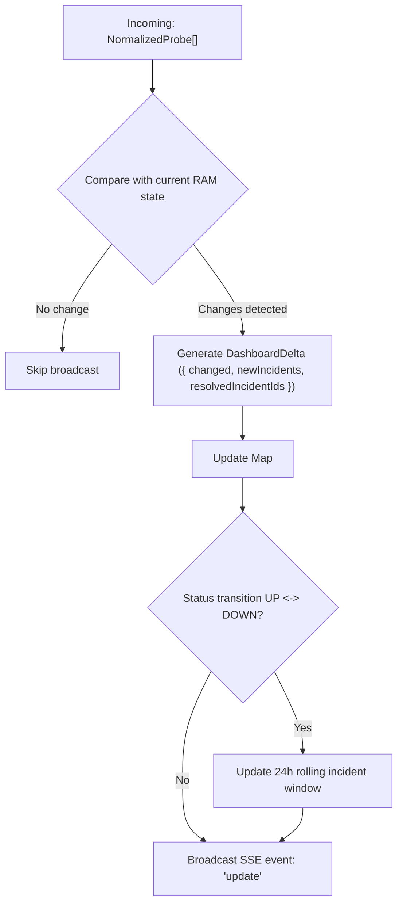
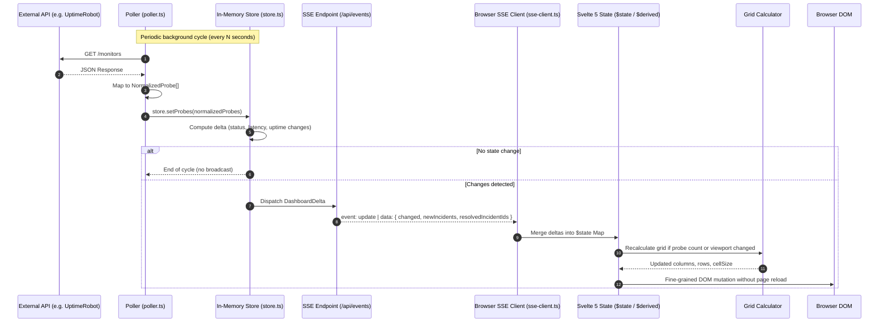

# Kato Architecture Reference

This document serves as the technical and architectural reference for the **Kato Dashboard** project. It details the engineering principles, data pipelines, TypeScript contracts, and implementation patterns designed for development with SvelteKit 2 and Svelte 5.

---

## 1. System Overview

Kato is an ultra-high-density Network Operations Center (NOC) and wallboard monitoring dashboard engineered to operate continuously on wall-mounted TVs, large displays, or operator workstations without requiring manual interaction.

### Core Principles

| Criterion | Specification | Architectural Rationale |
| :--- | :--- | :--- |
| **Density** | 1 to 200+ probes in a single view | **Zero scroll** horizontally or vertically on desktop/TV. The layout automatically adapts to available screen dimensions (`100vw` / `100vh`). |
| **Framework** | [SvelteKit](https://kit.svelte.dev/) (Svelte 5 Runes) | High-performance reactive compiler, minimal memory footprint, native SSR/BFF runtime on Node.js. |
| **Runtime** | `@sveltejs/adapter-node` | Persistent standalone Node.js server required to maintain SSE connections and background memory poller. |
| **Styling & UI** | Tailwind CSS v4 + PostCSS | Modern utility-first stylesheet engine without heavy JS configs, optimized for CSS Grid and Flexbox micro-cells. |
| **Type Safety** | TypeScript strict | End-to-end type safety from server BFF to client UI without duplication (`src/lib/types/index.ts`). |
| **Real-Time Stream** | Server-Sent Events (SSE) | Standardized unidirectional HTTP stream (`text/event-stream`), native automatic reconnect via `EventSource`. |
| **State Persistence** | **100% In-Memory (RAM)** | No SQL/NoSQL database required. Canonical state lives in memory and reconstructs on server boot via polling. |

---

## 2. Layered Architecture

The system implements a **BFF (Backend-For-Frontend)** pattern within SvelteKit, completely decoupling external third-party monitoring APIs from client browsers.

```
[External APIs] ──(HTTP Polling)──> [SvelteKit BFF (Server)] ──(SSE Stream)──> [Svelte 5 Client] ──> [Browser DOM]
```

```mermaid
flowchart LR
    subgraph External["External Sources"]
        API1["UptimeRobot API v3"]
        Mock["Procedural Mock Generator"]
    end

    subgraph Server["SvelteKit BFF (Node.js runtime)"]
        Adapter["Layer 1: MonitoringAdapter"]
        Poller["Layer 3: Poller Service"]
        Store["Layer 2: In-Memory Store (RAM)"]
        SSE["Layer 4: SSE Endpoint (/api/events)"]
        
        Poller -->|Scheduled Poll| Adapter
        Adapter -->|NormalizedProbe[]| Store
        Store -->|Deltas & Snapshots| SSE
    end

    subgraph Client["Browser Client"]
        SSEClient["SSE Client (EventSource)"]
        RunesState["Svelte 5 Runes ($state)"]
        GridCalc["Grid Calculator"]
        UI["Layer 5: UI Components (ProbeGrid)"]

        SSE -->|text/event-stream| SSEClient
        SSEClient -->|Deltas| RunesState
        RunesState --> GridCalc
        GridCalc --> UI
    end

    API1 -.-> Adapter
    Mock -.-> Adapter
```

---

### Layer 1: Monitoring Adapters (Server-Side)

*Source path:* [`src/lib/server/adapters/`](file:///var/www-jeremy/projets/kato-dashboard/src/lib/server/adapters/)

The adapter layer implements the **Adapter Pattern**, isolating vendor-specific response payloads and guaranteeing an immutable, unified data contract to the application.

#### Interface Definition ([`adapter.interface.ts`](file:///var/www-jeremy/projets/kato-dashboard/src/lib/server/adapters/adapter.interface.ts))

```typescript
import type { NormalizedProbe, NormalizedIncident, AdapterConfig } from '$lib/types';

export interface MonitoringAdapter {
  /** Unique identifier for the adapter (e.g., 'uptimerobot', 'mock') */
  readonly name: string;

  /** Initialize adapter configuration and credentials */
  initialize(config: AdapterConfig): Promise<void>;

  /** Fetch and normalize all active probes */
  fetchProbes(): Promise<NormalizedProbe[]>;

  /** Fetch active or recent incidents */
  fetchIncidents?(since: Date): Promise<NormalizedIncident[]>;

  /** Preferred polling interval in milliseconds */
  getPollingInterval(): number;
}
```

#### Normalized Models ([`src/lib/types/index.ts`](file:///var/www-jeremy/projets/kato-dashboard/src/lib/types/index.ts))

```typescript
export type ProbeStatus = 'up' | 'down' | 'degraded' | 'paused' | 'pending' | 'maintenance';
export type Criticality = 'critical' | 'high' | 'medium' | 'low';

export interface NormalizedProbe {
  id: string;                      // Universal unique ID (e.g. 'ur:12345')
  name: string;                    // Human-readable probe title
  url: string | null;              // Monitored target URL or IP
  status: ProbeStatus;             // Canonical status
  responseTime: number | null;     // Response latency in milliseconds
  uptime24h: number | null;        // 24-hour uptime ratio percentage (0–100)
  uptime7d: number | null;         // 7-day uptime ratio percentage (0–100)
  lastCheck: string;               // ISO 8601 UTC timestamp
  group: string | null;            // Category / tag group name
  criticality: Criticality;        // Severity level
  source: string;                  // Adapter identifier
  downSince?: string;              // ISO 8601 timestamp of outage beginning
}

export interface NormalizedIncident {
  id: string;
  probeId: string;
  probeName: string;
  type: 'down' | 'degraded';
  startedAt: string;               // ISO 8601 UTC
  resolvedAt: string | null;       // ISO 8601 UTC or null if ongoing
  duration: number | null;         // Outage duration in seconds
  cause?: string;
}
```

#### Implementations

1. **[`uptime-robot.adapter.ts`](file:///var/www-jeremy/projets/kato-dashboard/src/lib/server/adapters/uptime-robot.adapter.ts)**:
   - Polls UptimeRobot REST API v3 using Bearer authentication (`GET /monitors`).
   - Translates status codes into normalized `ProbeStatus`.
   - Normalizes tags, target URLs, and groups.
2. **[`uptime-kuma.adapter.ts`](file:///var/www-jeremy/projets/kato-dashboard/src/lib/server/adapters/uptime-kuma.adapter.ts)**:
   - Polls the UptimeKuma Prometheus `/metrics` endpoint using HTTP Basic Auth (empty username, API key as password).
   - Parses `monitor_status` and `monitor_response_time` Prometheus metrics without regex backtracking.
   - Derives probe ID from URL-encoded `monitor_name` label for stable cross-restart identity.
3. **[`mock.adapter.ts`](file:///var/www-jeremy/projets/kato-dashboard/src/lib/server/adapters/mock.adapter.ts)**:
   - High-performance deterministic generator simulating 1 to 300+ monitors across categorized services (`Websites`, `APIs`, `Databases`, `Infrastructure`).
   - Introduces realistic latency fluctuations and configurable intermittent failure cycles for testing transitions, alerts, and high-density rendering.

---

### Layer 2: In-Memory Store (Server-Side)

*Source path:* [`src/lib/server/store.ts`](file:///var/www-jeremy/projets/kato-dashboard/src/lib/server/store.ts)

The server store is a singleton operating in process RAM. It maintains canonical system state and performs fine-grained diff calculation (*delta detection*).



#### Responsibilities

- **Key-Value Storage**: Indexed in memory via `Map<string, NormalizedProbe>`.
- **Delta Generation**:
  ```typescript
  export interface DashboardDelta {
    changed: NormalizedProbe[];
    newIncidents: NormalizedIncident[];
    resolvedIncidentIds: string[];
    timestamp: string;
  }
  ```
- **Outage Detection**:
  - Compares `status`, `responseTime`, and `uptime24h`.
  - When transitioning to `'down'`, automatically creates a `NormalizedIncident` and tracks `downSince`.
  - When returning to `'up'`, marks incident resolved and calculates final duration.
- **Sliding 24h Buffer**: Prunes resolved incidents older than 24 hours (`Date.now() - 86_400_000`) on each polling cycle to preserve memory.
- **Fast Startup**: On server start, state populates within the initial polling execution.

---

### Layer 3: Poller Service (Server-Side)

*Source path:* [`src/lib/server/poller.ts`](file:///var/www-jeremy/projets/kato-dashboard/src/lib/server/poller.ts)

The poller executes on a recurring timer in the Node.js process:

- **Autostart**: Initialized in `src/hooks.server.ts` when the server boots.
- **Configurable Cadence**: Controlled via environment variable or adapter preference.
- **Concurrency Protection**: Uses execution guards to avoid overlapping polls if third-party APIs experience high latency.
- **Non-blocking Fault Tolerance**: Network failures or 5xx API errors are logged without clearing the current in-memory state. Probes retain their last known values.

---

### Layer 4: SSE Endpoint (Server-Side)

*Source path:* [`src/routes/api/events/+server.ts`](file:///var/www-jeremy/projets/kato-dashboard/src/routes/api/events/+server.ts)

Exposes a streaming endpoint compliant with W3C Server-Sent Events.

#### HTTP Headers

```http
HTTP/1.1 200 OK
Content-Type: text/event-stream
Cache-Control: no-cache, no-transform
Connection: keep-alive
X-Accel-Buffering: no
```

#### Event Typology

| Event Type | Frequency | Payload (`data`) | Description |
| :--- | :--- | :--- | :--- |
| `init` | Immediate on connection | `{ probes: NormalizedProbe[], incidents: NormalizedIncident[], lastUpdate: string, source: string }` | Complete system snapshot in RAM. |
| `update` | On state changes | `{ changed: NormalizedProbe[], newIncidents: NormalizedIncident[], resolvedIncidentIds: string[], timestamp: string }` | Differential deltas minimizing bandwidth. |
| `heartbeat` | Every 15 seconds | `{ timestamp: string }` | Keeps TCP connections active through proxies (Nginx, Traefik, Cloudflare). |

---

### Layer 5: Frontend Components & State (Client-Side)

*Source path:* [`src/lib/components/`](file:///var/www-jeremy/projets/kato-dashboard/src/lib/components/) & [`src/lib/utils/`](file:///var/www-jeremy/projets/kato-dashboard/src/lib/utils/)

Built on **Svelte 5** reactive primitives using Runes:

- **`$state`**: Holds probe dictionaries, active incidents, connection status (`connected | reconnecting | disconnected`), and modal state.
- **`$derived`**: Reactively computes:
  - System health ratio (`upCount / totalCount * 100`).
  - Prioritized display sort (critical `down` and `degraded` probes sorted first).
  - Optimal grid columns, rows, cell size, and density tier.
- **`$effect`**: Manages the `EventSource` lifecycle, heartbeat timers, and keyboard navigation listeners.

#### Zero-Scroll Adaptive Grid Engine ([`grid-calculator.ts`](file:///var/www-jeremy/projets/kato-dashboard/src/lib/utils/grid-calculator.ts))

Calculates optimal columns, rows, cell dimensions, and gaps to fit 100% of the viewport without overflowing:

```typescript
export interface GridLayout {
  density: 'large' | 'medium' | 'compact' | 'micro' | 'pixel';
  columns: number;
  rows: number;
  cellSize: number;
  gap: number;
  overflows: boolean;
}
```

---

## 3. End-to-End Data Flow



---

## 4. Security & Isolation

1. **Credentials Isolation**:
   - Provider API keys (`UPTIMEROBOT_API_KEY`, etc.) are read exclusively within server modules (`src/lib/server/`).
   - SvelteKit prevents any server module from leaking into client-side bundles.
   - Client probes never expose API tokens or private infrastructure configs.
2. **Optional Authentication**:
   - When `KATO_AUTH_ENABLED=true`, access to the dashboard and SSE stream requires a valid session cookie (`kato_auth`).
   - Password checked server-side with standard comparison.
   - Session cookie attributes: `HttpOnly`, `SameSite=Strict`, `Path=/`.
3. **SSE Protection**:
   - Unauthenticated access to `/api/events` is rejected with `HTTP 401 Unauthorized` or redirected to `/login`.

---

## 5. File Structure Reference

```
kato-dashboard/
├── docs/                              # Technical specifications and design docs
│   ├── ARCHITECTURE.md                # System architecture reference (this file)
│   ├── COLORS_AND_THEME.md            # Color palette, themes, and CSS animations
│   ├── DATA_MODEL.md                  # Canonical TypeScript data models
│   ├── GRID_ALGORITHM.md              # Mathematical zero-scroll layout algorithm
│   ├── UPTIME_ROBOT_API.md            # UptimeRobot v3 API implementation guide
│   └── UX_COMPONENTS.md               # Visual specs for Svelte components
├── src/
│   ├── lib/
│   │   ├── components/                # Svelte 5 components (PascalCase)
│   │   │   ├── DetailModal.svelte     # Probe metrics, 24h timeline, and incident history
│   │   │   ├── Header.svelte          # Header bar: score, badges, clock, settings trigger
│   │   │   ├── IncidentBar.svelte     # Marquee incident ticker bar
│   │   │   ├── KeyboardHelpModal.svelte # Keyboard shortcut help dialog
│   │   │   ├── LoginForm.svelte       # Password authentication view
│   │   │   ├── ProbeCell.svelte       # Standard, medium, and compact probe cell
│   │   │   ├── ProbeDot.svelte        # Micro and pixel density indicator
│   │   │   ├── ProbeGrid.svelte       # Adaptive zero-scroll grid container
│   │   │   └── SkipLink.svelte        # Accessible navigation skip link
│   │   ├── i18n/                      # Internationalization system
│   │   │   ├── locales/
│   │   │   │   ├── en.ts              # English dictionary
│   │   │   │   └── fr.ts              # French dictionary
│   │   │   ├── index.ts               # Locale resolution and reactivity
│   │   │   └── types.ts               # Translation schema types
│   │   ├── server/                    # Server-only BFF code
│   │   │   ├── adapters/
│   │   │   │   ├── adapter.interface.ts # MonitoringAdapter interface
│   │   │   │   ├── mock.adapter.ts    # Deterministic high-density mock generator
│   │   │   │   ├── uptime-robot.adapter.ts # UptimeRobot v3 REST client
│   │   │   │   └── uptime-kuma.adapter.ts  # UptimeKuma Prometheus /metrics client
│   │   │   ├── auth.ts                # Session authentication logic
│   │   │   ├── config.ts              # Environment configuration and fallbacks
│   │   │   ├── poller.ts              # Autonomous polling scheduler
│   │   │   └── store.ts               # In-Memory RAM singleton store with diffing
│   │   ├── types/
│   │   │   └── index.ts               # Shared TypeScript types & interfaces
│   │   └── utils/                     # Client utilities (kebab-case)
│   │       ├── clock.ts               # Timezone-aware clock utilities
│   │       ├── colors.ts              # Semantic status colors and badges
│   │       ├── fullscreen.ts          # Native fullscreen API helpers
│   │       ├── grid-calculator.ts     # Zero-scroll adaptive grid calculator
│   │       ├── incident-queue.ts      # FIFO marquee incident queue
│   │       ├── keyboard-grid.ts       # 2D arrow key grid navigation
│   │       ├── marquee.ts             # Ticker duration and animation controls
│   │       ├── probe-dot.ts           # Micro/pixel sizing helper
│   │       ├── probe-history.ts       # 24h hourly slots and history formatter
│   │       ├── sort.ts                # Smart prioritization and probe sorting
│   │       ├── sounds.ts              # Web Audio API alert chimes
│   │       ├── sse-client.ts          # Resilient SSE client with reconnect logic
│   │       ├── theme.ts               # Dark / Light / AMOLED theme manager
│   │       ├── tv-mode.ts             # 24/7 TV wallboard mode with anti burn-in
│   │       └── url-cleaner.ts         # URL display cleaner
│   ├── routes/
│   │   ├── api/
│   │   │   ├── events/+server.ts      # Server-Sent Events stream endpoint
│   │   │   └── probes/[id]/history/+server.ts # Server incident history endpoint
│   │   ├── login/
│   │   │   ├── +page.server.ts        # Auth form action handler
│   │   │   └── +page.svelte           # Login page
│   │   ├── +layout.server.ts          # Session and settings SSR data loader
│   │   ├── +layout.svelte             # Root layout with theme and viewport initialization
│   │   ├── +page.server.ts            # Dashboard page loader
│   │   └── +page.svelte               # Main dashboard orchestrator
│   ├── app.css                        # Tailwind CSS v4 entrypoint and custom styles
│   ├── app.html                       # HTML template with zero-flash theme bootstrap
│   └── hooks.server.ts                # Server bootstrap: poller lifecycle and auth guard
├── .env.example                       # Documented environment template
├── LICENSE                            # MIT License
├── package.json                       # Package dependencies and scripts
├── README.md                          # Project overview and quickstart
├── svelte.config.js                   # SvelteKit configuration
├── tsconfig.json                      # Strict TypeScript compiler options
└── vite.config.ts                     # Vite bundler configuration
```
