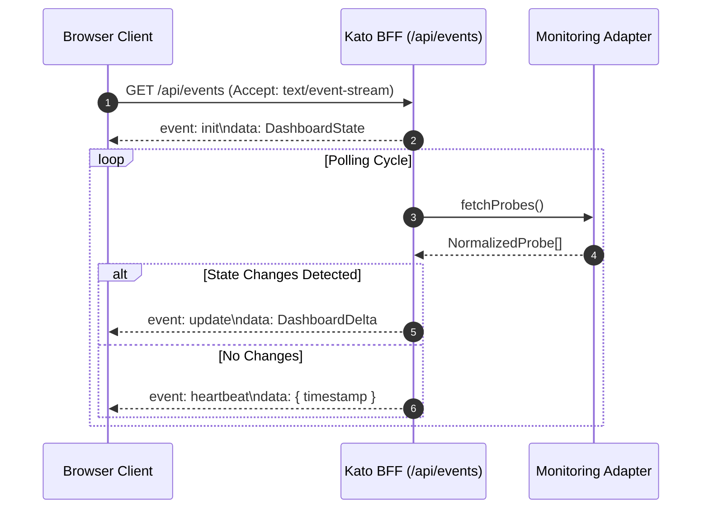

# Kato Data Model Reference

This document provides the canonical TypeScript data models and structure specifications for the **Kato Dashboard** project. It defines the source-agnostic normalized models, the monitoring adapter contracts, the real-time Server-Sent Events (SSE) synchronization protocol, and client state structures.

All implementations in the backend (BFF) and frontend must conform strictly to these interfaces and types.

---

## 1. Global TypeScript Definitions

Below is the complete TypeScript model with canonical JSDoc annotations.

```typescript
// ============================================
// STATUS & CRITICALITY
// ============================================

/** The 6 possible operational statuses of a probe */
export type ProbeStatus = 'up' | 'down' | 'degraded' | 'paused' | 'pending' | 'maintenance';

/** Probe criticality levels */
export type Criticality = 'critical' | 'high' | 'medium' | 'low';

// ============================================
// NORMALIZED MODEL (Source-Agnostic)
// ============================================

/** Normalized probe — unified model regardless of monitoring provider */
export interface NormalizedProbe {
  /** Unique ID prefixed by provider (e.g. "ur:12345", "mock:1") */
  id: string;
  /** Provider identifier ("uptimerobot" | "mock") */
  source: string;
  /** Human-readable probe title */
  name: string;
  /** Monitored target URL or IP */
  url: string | null;
  /** Canonical status */
  status: ProbeStatus;
  /** Response latency in ms (latest measure), null if unavailable */
  responseTime: number | null;
  /** 24-hour uptime percentage (0–100), null if unavailable */
  uptime24h: number | null;
  /** 7-day uptime percentage (0–100), null if unavailable */
  uptime7d: number | null;
  /** Last checked timestamp (ISO 8601 UTC) */
  lastCheck: string;
  /** Group / category tag (null if uncategorized) */
  group: string | null;
  /** Criticality level */
  criticality: Criticality;
  /** Outage start timestamp if status is down */
  downSince?: string;
}

/** Normalized incident record */
export interface NormalizedIncident {
  /** Unique incident ID */
  id: string;
  /** ID of affected probe */
  probeId: string;
  /** Probe name for instant display without client-side lookup */
  probeName: string;
  /** Incident severity type */
  type: 'down' | 'degraded';
  /** Incident start timestamp (ISO 8601 UTC) */
  startedAt: string;
  /** Resolution timestamp (ISO 8601 UTC), null if ongoing */
  resolvedAt: string | null;
  /** Duration in seconds, null if ongoing */
  duration: number | null;
  /** Error cause description or HTTP status code */
  cause?: string;
}

// ============================================
// DASHBOARD STATE & SSE PAYLOADS
// ============================================

/** Complete dashboard state snapshot sent via SSE */
export interface DashboardState {
  /** Full list of probes */
  probes: NormalizedProbe[];
  /** Active and recent incidents (rolling 24h window) */
  incidents: NormalizedIncident[];
  /** Latest update timestamp (ISO 8601 UTC) */
  lastUpdate: string;
  /** Name of active provider */
  source: string;
}

/** Differential delta sent via SSE on state transition */
export interface DashboardDelta {
  /** Probes with updated status, latency, or uptime */
  changed: NormalizedProbe[];
  /** Newly opened incidents */
  newIncidents: NormalizedIncident[];
  /** IDs of resolved incidents */
  resolvedIncidentIds: string[];
  /** Timestamp of update */
  timestamp: string;
}

// ============================================
// SSE STREAM TYPES
// ============================================

export type SSEEventType = 'init' | 'update' | 'heartbeat';

export type SSEEvent =
  | { type: 'init'; data: DashboardState }
  | { type: 'update'; data: DashboardDelta }
  | { type: 'heartbeat'; data: { timestamp: string } };

// ============================================
// ADAPTER INTERFACE
// ============================================

export interface AdapterConfig {
  [key: string]: string | number | boolean | undefined;
}

export interface MonitoringAdapter {
  /** Unique adapter identifier */
  readonly name: string;
  /** Initialize adapter credentials and configuration */
  initialize(config: AdapterConfig): Promise<void>;
  /** Fetch and normalize all active probes */
  fetchProbes(): Promise<NormalizedProbe[]>;
  /** Fetch recent incidents since given date */
  fetchIncidents?(since: Date): Promise<NormalizedIncident[]>;
  /** Polling interval in milliseconds */
  getPollingInterval(): number;
}

// ============================================
// CLIENT UI STATE
// ============================================

export type GridDensity = 'large' | 'medium' | 'compact' | 'micro' | 'pixel';
export type Theme = 'dark' | 'light' | 'amoled' | 'auto';
export type SortMode = 'smart' | 'status' | 'alpha' | 'latency' | 'group';

export interface GridLayout {
  density: GridDensity;
  columns: number;
  rows: number;
  cellSize: number; // in pixels
  gap: number;      // in pixels
  overflows: boolean;
}
```

---

## 2. Statuses, Criticality, and Visual Representation

Kato relies on a discrete set of canonical statuses (`ProbeStatus`). Each status maps to specific UI behaviors, color tokens, and accessibility attributes.

### Status Table

| `ProbeStatus` | Meaning | UI Behavior | Recommended Classes |
|---|---|---|---|
| `up` | Service operational, checks passing | Nominal stable display | `bg-emerald-500 text-white border-emerald-600` |
| `down` | Complete service outage | Top-priority alert, pulsing | `bg-rose-600 text-white border-rose-700 animate-pulse` |
| `degraded` | Elevated latency or intermittent failures | Moderate alert, attention required | `bg-amber-500 text-slate-900 border-amber-600` |
| `paused` | Monitoring intentionally paused | Dimmed / muted display | `bg-slate-500 text-white border-slate-600 opacity-60` |
| `pending` | Probe registered, awaiting initial check | Neutral / in-progress | `bg-blue-400 text-slate-900 border-blue-500 animate-pulse` |
| `maintenance` | Scheduled maintenance in progress | Informative status, non-penalizing | `bg-violet-500 text-white border-violet-600` |

### Criticality Levels (`Criticality`)

Criticality influences intelligent grid sorting (`sortMode: 'smart'`) and alert priorities:

- `critical`: Core business component (e.g. payment gateway, primary API). In `down` status, promoted to the top-left slot immediately.
- `high`: Primary high-impact service (e.g. customer portal, main database).
- `medium`: Secondary or redundant service (e.g. async worker, replica).
- `low`: Ancillary service or internal administration tool.

---

## 3. UptimeRobot Mapping Reference

UptimeRobot exposes statuses as numeric codes in its REST API (`GET /monitors`). The following table establishes the canonical mapping to `ProbeStatus`:

| UptimeRobot Status | Code | Kato `ProbeStatus` | Description |
|---|---|---|---|
| **Paused** | `0` | `paused` | Monitor paused manually in UptimeRobot. |
| **Not checked yet** | `1` | `pending` | Monitor created, initial check scheduled. |
| **Up** | `2` | `up` | Latest check succeeded with HTTP 2xx/3xx or ping success. |
| **Seems down** | `8` | `degraded` | First check failed, awaiting verification before declaring outage. |
| **Down** | `9` | `down` | Outage confirmed across multiple verification nodes. |

### Handling `maintenance` Status

UptimeRobot does not return a dedicated numeric status code for maintenance. Kato applies the following heuristics in order:

1. **Naming Conventions**: Names containing `[MAINT]`, `[MAINTENANCE]`, or `(Maintenance)` are flagged as `maintenance` (unless manually paused `0`).
2. **Tags & Groups**: Probes assigned to tags or categories designated for maintenance.
3. **Maintenance Windows**: Active maintenance window periods reported in monitor metadata.

---

## 4. Real-Time Server-Sent Events Protocol

State synchronizes between the SvelteKit BFF and the browser via Server-Sent Events at `/api/events`:



### Event Specifications

1. **`init` (`DashboardState`)**: Dispatched immediately upon client connection. Transmits the full state of all probes and recent incidents.
2. **`update` (`DashboardDelta`)**: Dispatched when probe statuses change, new incidents open, or active incidents resolve.
3. **`heartbeat`**: Periodic ping every 15 seconds to prevent intermediate proxy timeouts.
