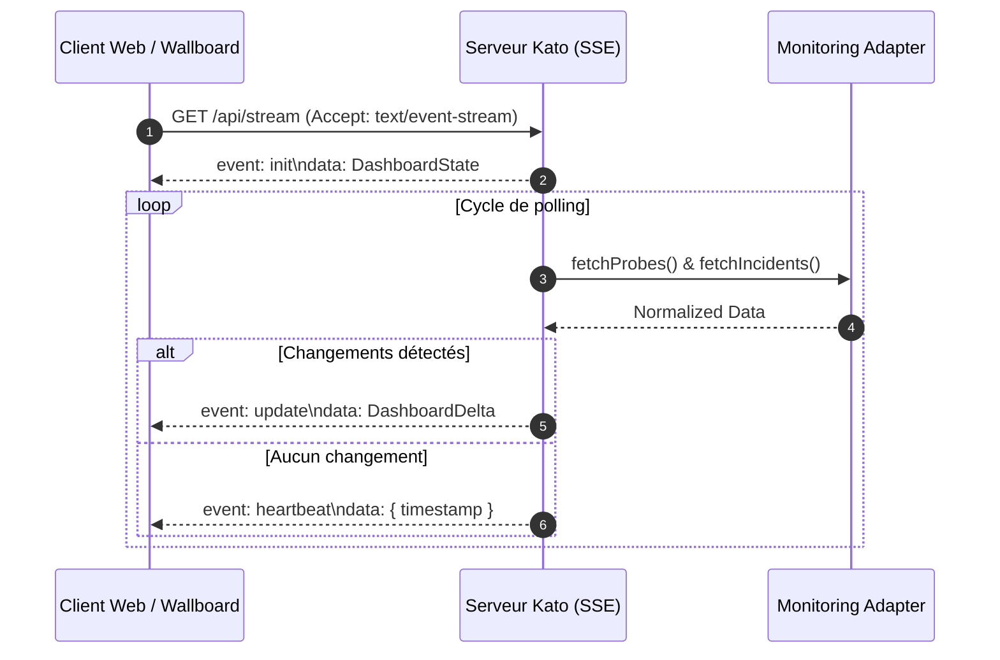

# Modèle de Données Kato

Ce document constitue la référence canonique des types et structures de données pour le projet **Kato Dashboard**. Il définit le modèle unifié indépendant des fournisseurs de monitoring, le contrat des adaptateurs, les événements de synchronisation temps réel par Server-Sent Events (SSE), ainsi que l'état côté client.

Toute implémentation dans le backend ou le frontend doit impérativement se conformer aux interfaces et types définis ci-après.

---

## 1. Définitions Globales TypeScript

Le listing ci-dessous regroupe l'intégralité du modèle TypeScript avec ses annotations JSDoc canoniques.

```typescript
// ============================================
// STATUTS
// ============================================

/** Les 6 statuts possibles d'une sonde */
export type ProbeStatus = 'up' | 'down' | 'degraded' | 'paused' | 'pending' | 'maintenance';

/** Niveaux de criticité */
export type Criticality = 'critical' | 'high' | 'medium' | 'low';

// ============================================
// MODÈLE NORMALISÉ (indépendant de la source)
// ============================================

/** Sonde normalisée — modèle unifié quelle que soit la source */
export interface NormalizedProbe {
  /** ID unique préfixé par la source (ex: "ur:12345", "mock:1") */
  id: string;
  /** Identifiant de la source ("uptimerobot" | "hetrix" | "mock") */
  source: string;
  /** Nom lisible de la sonde */
  name: string;
  /** URL ou IP monitorée */
  url: string;
  /** Statut actuel */
  status: ProbeStatus;
  /** Temps de réponse en ms (dernière mesure), null si indisponible */
  responseTime: number | null;
  /** Uptime sur 24h (0-100), null si indisponible */
  uptime24h: number | null;
  /** Uptime sur 7 jours (0-100), null si indisponible */
  uptime7d: number | null;
  /** Date du dernier check (ISO 8601) */
  lastCheck: string;
  /** Groupe/tag (null si aucun) */
  group: string | null;
  /** Niveau de criticité */
  criticality: Criticality;
}

/** Incident normalisé */
export interface NormalizedIncident {
  /** ID unique de l'incident */
  id: string;
  /** ID de la sonde concernée */
  probeId: string;
  /** Nom de la sonde (pour affichage sans lookup) */
  probeName: string;
  /** Type d'incident */
  type: 'down' | 'degraded';
  /** Début de l'incident (ISO 8601) */
  startedAt: string;
  /** Fin de l'incident (ISO 8601), null si toujours actif */
  resolvedAt: string | null;
  /** Durée en secondes, null si toujours actif */
  duration: number | null;
}

// ============================================
// ÉTAT DU DASHBOARD
// ============================================

/** État complet du dashboard envoyé via SSE */
export interface DashboardState {
  /** Liste de toutes les sondes */
  probes: NormalizedProbe[];
  /** Incidents actifs + récents (rolling 24h) */
  incidents: NormalizedIncident[];
  /** Date de dernière mise à jour (ISO 8601) */
  lastUpdate: string;
  /** Nom de la source active */
  source: string;
}

/** Delta envoyé via SSE quand l'état change */
export interface DashboardDelta {
  /** Sondes dont le statut a changé */
  changed: NormalizedProbe[];
  /** Nouveaux incidents */
  newIncidents: NormalizedIncident[];
  /** Incidents résolus (IDs) */
  resolvedIncidentIds: string[];
  /** Timestamp de la mise à jour */
  timestamp: string;
}

// ============================================
// SSE EVENT TYPES
// ============================================

/** Types d'événements SSE */
export type SSEEventType = 'init' | 'update' | 'heartbeat';

/** Événement SSE typé */
export type SSEEvent =
  | { type: 'init'; data: DashboardState }
  | { type: 'update'; data: DashboardDelta }
  | { type: 'heartbeat'; data: { timestamp: string } };

// ============================================
// ADAPTER INTERFACE
// ============================================

/** Configuration d'un adapter */
export interface AdapterConfig {
  [key: string]: string | number | boolean;
}

/** Interface que chaque adapter doit implémenter */
export interface MonitoringAdapter {
  /** Nom unique de l'adapter */
  readonly name: string;
  /** Initialise l'adapter */
  initialize(config: AdapterConfig): Promise<void>;
  /** Récupère toutes les sondes */
  fetchProbes(): Promise<NormalizedProbe[]>;
  /** Récupère les incidents depuis une date */
  fetchIncidents(since: Date): Promise<NormalizedIncident[]>;
  /** Intervalle de polling recommandé en ms */
  getPollingInterval(): number;
}

// ============================================
// CONFIGURATION
// ============================================

/** Configuration de l'application */
export interface KatoConfig {
  adapter: 'uptimerobot' | 'mock';
  authEnabled: boolean;
  authPassword: string | null;
  port: number;
  host: string;
}

/** Configuration spécifique Uptime Robot */
export interface UptimeRobotConfig extends AdapterConfig {
  apiKey: string;
  pollInterval: number; // ms
}

// ============================================
// UI STATE (client-side)
// ============================================

/** Mode de densité de la grille */
export type GridDensity = 'large' | 'medium' | 'compact' | 'micro' | 'pixel';

/** Thème de l'application */
export type Theme = 'dark' | 'light' | 'amoled' | 'auto';

/** Préférences utilisateur (stockées en LocalStorage) */
export interface UserPreferences {
  theme: Theme;
  sortMode: 'smart' | 'alpha' | 'group';
  soundEnabled: boolean;
  tvAutoFullscreen: boolean;
}

/** Résultat du calcul de grille */
export interface GridLayout {
  density: GridDensity;
  columns: number;
  rows: number;
  cellSize: number; // px
  gap: number; // px
}
```

---

## 2. Statuts, Criticité et Rendu Visuel

Le système repose sur un ensemble fini de statuts canoniques (`ProbeStatus`). Chaque statut est associé à une signification opérationnelle précise et à des classes utilitaires Tailwind CSS standardisées pour l'affichage (pastilles, bordures, badges et animations).

### Tableau des statuts

| `ProbeStatus` | Signification | Comportement UI | Classes Tailwind CSS recommandées |
|---|---|---|---|
| `up` | Service opérationnel, contrôles valides | Affichage nominal stable | `bg-emerald-500 text-white border-emerald-600` |
| `down` | Service totalement indisponible | Alerte visuelle prioritaire, pulsation | `bg-rose-600 text-white border-rose-700 animate-pulse` |
| `degraded` | Temps de réponse excessif ou instabilité | Alerte modérée, attention requise | `bg-amber-500 text-slate-900 border-amber-600` |
| `paused` | Surveillance suspendue volontairement | Affichage estompé / grisé | `bg-slate-500 text-white border-slate-600 opacity-60` |
| `pending` | Sonde créée mais premier check en attente | Neutre / transition | `bg-blue-400 text-slate-900 border-blue-500 animate-pulse` |
| `maintenance` | Travaux programmés en cours | Statut informatif, non pénalisant | `bg-purple-500 text-white border-purple-600` |

### Niveaux de criticité (`Criticality`)

La criticité conditionne le tri intelligent (`sortMode: 'smart'`) et l'intensité des alertes sonores ou visuelles en cas de coupure :

* `critical` : Composant vital (ex. passerelle de paiement, API centrale). En cas de statut `down`, remonte en tête de grille immédiatement.
* `high` : Service principal à fort impact (ex. portail client, base principale).
* `medium` : Service intermédiaire ou redondé (ex. worker asynchrone, réplica).
* `low` : Service secondaire ou d'administration interne.

---

## 3. Mapping Spécifique Uptime Robot

Uptime Robot expose ses statuts sous forme de codes numériques entiers via son API v2 (`getMonitors`). La table suivante établit la correspondance stricte avec le modèle `ProbeStatus` de Kato :

| Uptime Robot Status | Code UR | ProbeStatus Kato | Description & Interprétation |
|---|---|---|---|
| **Paused** | `0` | `paused` | La sonde a été mise en pause manuellement dans Uptime Robot. |
| **Not checked yet** | `1` | `pending` | Sonde enregistrée, première collecte en cours de planification. |
| **Up** | `2` | `up` | Le dernier test HTTP / ping / port a retourné un code succès. |
| **Seems down** | `8` | `degraded` | Premier échec détecté, phase de confirmation en cours avant bascule down. |
| **Down** | `9` | `down` | Panne confirmée par plusieurs points de vérification. |

### Gestion du statut `maintenance`

> [!IMPORTANT]
> Le statut `maintenance` n'existe pas en tant que code d'état d'exécution distinct dans l'API native d'Uptime Robot (qui n'expose que `0, 1, 2, 8, 9`).

Pour attribuer le statut `maintenance` à une sonde provenant d'Uptime Robot, l'adaptateur Kato applique les règles de détection suivantes dans l'ordre de priorité :

1. **Convention de nommage (Prefix/Suffix) :**
   Si le nom de la sonde contient une balise explicite comme `[MAINT]`, `[MAINTENANCE]` ou `(Maintenance)`, l'adaptateur override le statut vers `maintenance` sauf si la sonde est manuellement en pause (`0`).
2. **Tags / Groupes Uptime Robot :**
   Si la sonde est associée à un tag dédié (ex: `maintenance`, `maint`) ou classée dans un groupe désigné pour la maintenance via la configuration.
3. **Fenêtres de maintenance (Maintenance Windows) :**
   Si l'API Uptime Robot renvoie une fenêtre active associée au moniteur (`mwindow`), la sonde est basculée en statut `maintenance` pendant la durée de cette fenêtre.

---

## 4. Spécifications du Modèle Normalisé

### `NormalizedProbe`
Chaque sonde normalisée possède :
* **`id`** : Chaîne composite garantissant l'unicité globale multi-sources. Elle suit le schéma `{source_prefix}:{source_id}` (exemple : `"ur:7849102"`, `"mock:probe-4"`).
* **`source`** : Identifiant de l'adaptateur source (`uptimerobot`, `mock`, ou future source `hetrix`).
* **`url`** : Cible réseau surveillée (URL HTTP/HTTPS, adresse IPv4/IPv6 ou FQDN).
* **`responseTime`** : Temps en millisecondes (`null` si sonde en pause, en attente ou injoignable).
* **`uptime24h` / `uptime7d`** : Pourcentages de disponibilité exprimés sous forme de nombres décimaux compris entre `0` et `100` (ex: `99.95`), ou `null` si non calculables.
* **`lastCheck`** : Horodatage strict au format ISO 8601 UTC (ex: `"2026-09-19T09:40:00.000Z"`).
* **`group`** : Nom de regroupement logique pour les vues catégorisées ou `null`.
* **`criticality`** : Priorité attribuée (par configuration de tags ou défaut `medium`).

### `NormalizedIncident`
* **`id`** : Identifiant unique de l'événement d'incident (ex: `"inc:ur:7849102:1726738800"`).
* **`probeId`** : Référence directe vers l'`id` de la `NormalizedProbe`.
* **`probeName`** : Nom de la sonde dupliqué pour permettre un affichage rapide dans les listes d'alertes sans jointure côté client.
* **`type`** : Catégorie du problème (`down` pour arrêt total, `degraded` pour dégradation de performance ou instabilité).
* **`startedAt`** : Date de début d'incident (ISO 8601).
* **`resolvedAt`** : Date de rétablissement (ISO 8601), `null` tant que l'incident est actif.
* **`duration`** : Temps d'indisponibilité en secondes, calculé automatiquement lors de la résolution (`null` pendant la durée active).

---

## 5. Protocole Temps Réel Server-Sent Events (SSE)

La distribution des données depuis le serveur Kato vers le client s'effectue via un flux SSE (`/api/stream`).



### Types d'événements :
1. **`init` (`DashboardState`)** :
   Envoyé immédiatement après l'établissement de la connexion HTTP SSE. Transmet l'intégralité du parc de sondes et la liste des incidents actifs ainsi que ceux résolus au cours des 24 dernières heures (fenêtre glissante).
2. **`update` (`DashboardDelta`)** :
   Émis dès qu'une modification d'état est détectée (changement de statut d'une sonde, variation de temps de réponse significative, ouverture d'un nouvel incident ou résolution). Réduit la consommation de bande passante et le coût de réconciliation DOM.
3. **`heartbeat`** :
   Trame périodique (toutes les 15 à 30 secondes) pour prévenir l'interruption de la socket par les proxys inverses (Nginx, Cloudflare) ou les timeouts du navigateur.

---

## 6. Architecture des Adaptateurs (`MonitoringAdapter`)

Le moteur Kato est agnostique vis-à-vis du fournisseur de monitoring. Tout service tiers est encapsulé dans une classe respectant le contrat `MonitoringAdapter`.

### Cycle de vie d'un adaptateur :
1. **Instanciation** : La fabrique sélectionne l'adaptateur désigné dans `KatoConfig.adapter`.
2. **`initialize(config: AdapterConfig)`** : Validation de la clé d'API, vérification de l'accessibilité réseau et configuration des paramètres de requêtage.
3. **`getPollingInterval()`** : Fournit au scheduler de Kato le délai d'attente optimal (ex: 60 000 ms pour Uptime Robot API free/pro, 5 000 ms pour un mock de simulation).
4. **`fetchProbes()`** : Appel API distant, parsing de la charge utile, conversion des statuts et mapping vers `NormalizedProbe[]`.
5. **`fetchIncidents(since: Date)`** : Récupération des logs de coupure depuis la date fournie et conversion vers `NormalizedIncident[]`.

---

## 7. État Client et Moteur de Grille UI

L'interface Kato est conçue pour les affichages muraux (wallboards TV) et les stations de supervision.

### Densités de grille (`GridDensity`)

Le calcul de la disposition (`GridLayout`) adapte automatiquement le ratio et la taille des tuiles selon le nombre de sondes et la résolution de l'écran :

| `GridDensity` | Nombre typique de sondes | Détails affichés | Classes CSS Tailwind indicatives |
|---|---|---|---|
| `large` | 1 à 12 | Nom, URL, Uptime 24h/7d, Temps ms, Badge, Graphique sparkline | `grid grid-cols-1 md:grid-cols-2 lg:grid-cols-3 gap-6 p-6` |
| `medium` | 13 à 48 | Nom, Temps ms, Uptime 24h, Statut badge | `grid grid-cols-2 md:grid-cols-4 lg:grid-cols-6 gap-4 p-4` |
| `compact` | 49 à 120 | Nom tronqué, Pastille de statut, Temps ms | `grid grid-cols-4 md:grid-cols-8 lg:grid-cols-12 gap-2 p-3 text-xs` |
| `micro` | 121 à 300 | Pastille rectangulaire compacte avec nom réduit | `grid grid-cols-8 md:grid-cols-12 lg:grid-cols-16 gap-1.5 p-2` |
| `pixel` | 300+ | Matrice de carrés d'état (Heatmap dense) | `grid grid-cols-12 md:grid-cols-20 lg:grid-cols-24 gap-1 p-1` |

### Thèmes supportés (`Theme`)
* `dark` : Thème sombre standard (fond ardoise `bg-slate-900`, cartes `bg-slate-800`).
* `light` : Thème clair haute lisibilité (fond `bg-slate-100`, cartes `bg-white`).
* `amoled` : Fond noir absolu (`bg-black`) pour dalles OLED/écrans TV basse consommation.
* `auto` : Respect de la variable CSS média système `prefers-color-scheme`.

### Persistance (`UserPreferences`)
Les préférences sont persistées dans le `localStorage` du navigateur sous la clé `kato_user_preferences` sous forme de chaîne JSON correspondant à l'interface `UserPreferences`.
