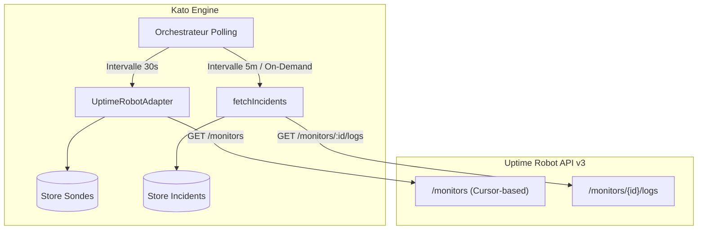

# Uptime Robot API v3 — Référence Adapter

Ce document constitue la spécification technique et la référence d'implémentation pour l'adaptateur Uptime Robot au sein du système de supervision Kato Dashboard.

---

## 1. Vue d'ensemble & Architecture

L'adaptateur Uptime Robot (`uptime-robot.adapter.ts`) assure la synchronisation entre l'API REST v3 d'Uptime Robot et le modèle unifié de données Kato (`NormalizedProbe`, `NormalizedIncident`).



---

## 2. Spécifications Réseau & Authentification

### Base URL
```
https://api.uptimerobot.com/v3
```

### Authentification
L'API v3 s'appuie sur une authentification par jeton Bearer HTTP dans les entêtes de requête :

```http
Authorization: Bearer <api_key>
Content-Type: application/json
```

- **Nature de la clé** : Clé API générée depuis la console Uptime Robot (*My Settings > API Settings*). Une clé en lecture seule (*Read-Only API Key*) ou principale (*Main API Key*) est acceptée. Le principe du moindre privilège impose l'utilisation d'une *Read-Only API Key*.
- **Variable d'environnement requise** : `UPTIMEROBOT_API_KEY`
- **Variable d'environnement optionnelle** : `UPTIMEROBOT_POLL_INTERVAL` (ms, défaut : `30000`)

---

## 3. Quotas et Limites de Débit (Rate Limits)

| Formule d'abonnement | Quota d'appels autorisés | Recommandation Kato Dashboard |
|---|---|---|
| **FREE** | 10 requêtes / minute | Polling `GET /monitors` à **30s** (2 req/min) |
| **PRO** | `nb_monitors × 2` req / min (plafond à 5 000 req/min) | Polling `GET /monitors` configurable à **10s–15s** |

> [!IMPORTANT]
> Sur le plan **FREE**, le calcul du budget de requêtes interdit tout rafraîchissement unitaire par moniteur. La récupération globale via `GET /monitors` consomme 2 req/min (avec intervalle de 30s), laissant une marge de sécurité de 8 req/min pour les opérations annexes ou les vérifications d'incidents différées.

---

## 4. Typages TypeScript des Modèles Kato

L'adaptateur produit des structures normalisées conformes aux définitions suivantes :

```typescript
export type ProbeStatus = 'up' | 'down' | 'degraded' | 'paused' | 'pending';
export type ProbeCriticality = 'low' | 'medium' | 'high' | 'critical';

export interface NormalizedProbe {
  id: string;                      // Préfixé 'ur:{id}'
  name: string;                    // Nom extrait (sans préfixe groupe)
  group: string;                   // Nom du groupe ou 'Default'
  url: string;                     // URL ou cible supervisée
  status: ProbeStatus;             // Statut normalisé
  criticality: ProbeCriticality;   // Par défaut 'medium'
  responseTime: number | null;     // Phase 2 (null actuellement)
  uptime24h: number | null;        // Phase 2 (null actuellement)
  uptime7d: number | null;         // Phase 2 (null actuellement)
  lastCheckedAt: string;           // ISO 8601 UTC
  isStale?: boolean;               // True si données conservées sur panne réseau
}

export interface NormalizedIncident {
  id: string;                      // 'ur:inc:{monitorId}:{timestamp}'
  probeId: string;                 // 'ur:{monitorId}'
  startedAt: string;               // ISO 8601 UTC
  resolvedAt: string | null;       // ISO 8601 UTC ou null si toujours actif
  durationSeconds: number | null;  // Durée d'interruption
  cause: string;                   // Raison HTTP ou message UR
}
```

---

## 5. Endpoints de l'API v3 Utilisés

### 5.1 GET `/monitors`
Récupère l'inventaire complet des sondes configurées avec pagination par curseur.

#### Paramètres de Requête (Query Params)
| Paramètre | Type | Requis | Description |
|---|---|---|---|
| `cursor` | `string` | Non | Jeton opaque pointant vers le segment suivant. |
| `per_page` | `number` | Non | Éléments par page. Défaut : `50`, Maximum : `100`. |

#### Format de Requête
```http
GET /monitors?per_page=100 HTTP/1.1
Host: api.uptimerobot.com
Authorization: Bearer <UPTIMEROBOT_API_KEY>
Accept: application/json
```

#### Format de Réponse (Succès 200 OK)
```json
{
  "data": [
    {
      "id": 12345,
      "friendly_name": "[Core] API Production",
      "url": "https://api.example.com/health",
      "type": 1,
      "status": 2,
      "interval": 300,
      "create_datetime": "2024-01-15T10:00:00Z"
    },
    {
      "id": 12346,
      "friendly_name": "[DB] PostgreSQL Master",
      "url": "db.internal.example.com",
      "type": 4,
      "status": 9,
      "interval": 60,
      "create_datetime": "2024-02-01T08:30:00Z"
    }
  ],
  "pagination": {
    "next_cursor": "eyJpZCI6MTIzNDZ9",
    "has_more": false
  }
}
```

#### Monitor Types (Types de moniteurs)
| Code | Type UR | Description technique |
|---|---|---|
| `1` | **HTTP(s)** | Requête HTTP/HTTPS avec validation de code retour |
| `2` | **Keyword** | Recherche de présence/absence d'une chaîne dans le corps HTTP |
| `3` | **Ping** | Requête d'écho ICMP |
| `4` | **Port** | Test d'ouverture de socket TCP (ex: 5432, 3306, 22) |
| `5` | **Heartbeat** | Sonde passive attendant un push régulier (Dead Man's Switch) |

#### Monitor Statuses & Mapping Kato
| Code UR | Libellé Uptime Robot | Statut Kato | Description & Rationale |
|---|---|---|---|
| `0` | **Paused** | `paused` | Surveillance désactivée volontairement. |
| `1` | **Not checked yet** | `pending` | Moniteur initialisé sans exécution complétée. |
| `2` | **Up** | `up` | Vérification validée avec succès. |
| `8` | **Seems down** | `degraded` | Premier échec constaté, en cours de re-test. |
| `9` | **Down** | `down` | Incident avéré et confirmé. |

---

### 5.2 GET `/monitors/{id}`
Récupération détaillée d'un moniteur spécifique. La structure de l'objet retourné dans `data` est identique à celle des entrées du tableau de `/monitors`.

---

### 5.3 GET `/monitors/{id}/logs`
Récupération de l'historique chronologique des bascules d'état (incidents, reprises, interruptions).

#### Format de Requête
```http
GET /monitors/12345/logs HTTP/1.1
Host: api.uptimerobot.com
Authorization: Bearer <UPTIMEROBOT_API_KEY>
Accept: application/json
```

#### Format de Réponse (Succès 200 OK)
```json
{
  "data": [
    {
      "type": 1,
      "datetime": "2024-01-15T10:30:00Z",
      "duration": 120,
      "reason": {
        "code": "503",
        "detail": "Service Unavailable"
      }
    },
    {
      "type": 2,
      "datetime": "2024-01-15T10:32:00Z",
      "duration": 0,
      "reason": {
        "code": "200",
        "detail": "OK"
      }
    }
  ]
}
```

#### Log Types (Codes d'événements)
| Code | Événement | Description | Impact Kato |
|---|---|---|---|
| `1` | **Down** | Bascule en panne avérée | Instanciation d'un incident |
| `2` | **Up** | Rétablissement du service | Clôture de l'incident associé |
| `98` | **Started** | Démarrage de la surveillance | Événement informatif de cycle de vie |
| `99` | **Paused** | Suspension de la surveillance | Événement informatif de cycle de vie |

---

## 6. Guide de Conception de l'Adaptateur

L'adaptateur `UptimeRobotAdapter` implémente le contrat de service `MonitoringAdapter`.

### 6.1 Spécification des Méthodes

#### 1. `initialize(config: AdapterConfig): Promise<void>`
- Vérifie la présence de `UPTIMEROBOT_API_KEY`.
- Lance un probe de connectivité réseau : `GET /monitors?per_page=1`.
- Lève une exception explicite en cas d'absence de configuration ou de rejet de l'authentification.

#### 2. `fetchProbes(): Promise<NormalizedProbe[]>`
- Exécute une itération de requêtes `GET /monitors` avec `per_page=100`.
- Implémente la boucle de parcours du curseur tant que `pagination.has_more === true`.
- Applique les règles de normalisation :
  - **Identifiant** : Préfixé sous la forme `ur:${monitor.id}` pour garantir l'unicité inter-adaptateurs.
  - **Groupe & Nom** : Extraction selon la convention de nommage `"[GroupName] MonitorName"`.
    - Si le nom matche `/^\[(.*?)\]\s*(.*)$/`, `group = $1` et `name = $2`.
    - Sinon, `group = "Default"` et `name = monitor.friendly_name`.
  - **Statut** : Conversion stricte via la table de correspondance (0→`paused`, 1→`pending`, 2→`up`, 8→`degraded`, 9→`down`).
  - **Criticité** : Affectation de `'medium'` par défaut (non fournie nativement par Uptime Robot).
  - **Métriques complémentaires** : Initialiser `responseTime: null`, `uptime24h: null`, `uptime7d: null` (réservées à la Phase 2).
  - **Horodatage** : Conserver `lastCheckedAt` à l'heure courante UTC de réception.

#### 3. `fetchIncidents(since: Date): Promise<NormalizedIncident[]>`
> [!WARNING]
> Cet endpoint nécessite $N$ requêtes HTTP (1 requête par moniteur). Il ne doit **jamais** être invoqué lors du cycle de polling régulier des sondes (30s) sous peine d'épuiser immédiatement les quotas Rate Limit (notamment en plan FREE).
> 
> **Règle d'exécution** : Cadencer l'appel à `fetchIncidents` toutes les **5 minutes**, ou l'exécuter à la demande lors de la consultation explicite de la vue Incidents.

- Parcourt la liste des moniteurs connus.
- Interroge `GET /monitors/{id}/logs`.
- Filtre les enregistrements dont `type === 1` (*Down*) et dont le champ `datetime >= since.toISOString()`.
- Produit la structure `NormalizedIncident` avec conversion de durée et déduction du `resolvedAt`.

#### 4. `getPollingInterval(): number`
- Lit la variable d'environnement `process.env.UPTIMEROBOT_POLL_INTERVAL`.
- Valide la présence d'une valeur numérique valide supérieure ou égale à 10000 ms.
- Retourne `30000` (30 secondes) par défaut.

---

### 6.2 Implémentation de Référence TypeScript

Fichier cible : `src/adapters/uptime-robot.adapter.ts`

```typescript
import {
  NormalizedProbe,
  NormalizedIncident,
  ProbeStatus,
  ProbeCriticality
} from '../types/monitoring';

export interface UptimeRobotConfig {
  apiKey: string;
  baseUrl?: string;
  pollIntervalMs?: number;
}

interface URMonitor {
  id: number;
  friendly_name: string;
  url: string;
  type: number;
  status: number;
  interval: number;
  create_datetime: string;
}

interface URLog {
  type: number;
  datetime: string;
  duration: number;
  reason: {
    code: string;
    detail: string;
  };
}

interface URResponse<T> {
  data: T;
  pagination?: {
    next_cursor?: string;
    has_more: boolean;
  };
  error?: {
    message: string;
  };
}

export class UptimeRobotAdapter {
  private readonly baseUrl: string;
  private readonly apiKey: string;
  private readonly pollIntervalMs: number;
  private isStale: boolean = false;

  constructor(config: UptimeRobotConfig) {
    if (!config.apiKey) {
      throw new Error("Configuration manquante : UPTIMEROBOT_API_KEY est requise.");
    }
    this.apiKey = config.apiKey;
    this.baseUrl = config.baseUrl || 'https://api.uptimerobot.com/v3';
    this.pollIntervalMs = config.pollIntervalMs || 30_000;
  }

  public async initialize(): Promise<void> {
    try {
      await this.request<URMonitor[]>('/monitors?per_page=1');
      this.isStale = false;
    } catch (error: any) {
      throw new Error(`Échec de l'initialisation Uptime Robot : ${error.message}`);
    }
  }

  public getPollingInterval(): number {
    const envVal = process.env.UPTIMEROBOT_POLL_INTERVAL;
    if (envVal) {
      const parsed = parseInt(envVal, 10);
      if (!isNaN(parsed) && parsed >= 10_000) {
        return parsed;
      }
    }
    return this.pollIntervalMs;
  }

  public async fetchProbes(): Promise<NormalizedProbe[]> {
    const monitors: URMonitor[] = [];
    let cursor: string | undefined = undefined;
    let hasMore = true;

    while (hasMore) {
      const endpoint = cursor
        ? `/monitors?per_page=100&cursor=${encodeURIComponent(cursor)}`
        : `/monitors?per_page=100`;

      const response = await this.request<URMonitor[]>(endpoint);
      monitors.push(...response.data);

      hasMore = Boolean(response.pagination?.has_more);
      cursor = response.pagination?.next_cursor;
    }

    const now = new Date().toISOString();

    return monitors.map((m) => {
      const { group, name } = this.parseNameAndGroup(m.friendly_name);
      return {
        id: `ur:${m.id}`,
        name,
        group,
        url: m.url,
        status: this.mapStatus(m.status),
        criticality: 'medium' as ProbeCriticality,
        responseTime: null,
        uptime24h: null,
        uptime7d: null,
        lastCheckedAt: now,
        isStale: this.isStale
      };
    });
  }

  public async fetchIncidents(since: Date): Promise<NormalizedIncident[]> {
    const probes = await this.fetchProbes();
    const incidents: NormalizedIncident[] = [];
    const sinceIso = since.toISOString();

    for (const probe of probes) {
      const numericId = probe.id.replace('ur:', '');
      try {
        const response = await this.request<URLog[]>(`/monitors/${numericId}/logs`);
        const downLogs = response.data.filter(
          (log) => log.type === 1 && log.datetime >= sinceIso
        );

        for (const log of downLogs) {
          const startTimestamp = new Date(log.datetime).getTime();
          const resolvedDate = log.duration > 0
            ? new Date(startTimestamp + log.duration * 1000).toISOString()
            : null;

          incidents.push({
            id: `ur:inc:${numericId}:${startTimestamp}`,
            probeId: probe.id,
            startedAt: log.datetime,
            resolvedAt: resolvedDate,
            durationSeconds: log.duration > 0 ? log.duration : null,
            cause: `${log.reason.code} - ${log.reason.detail || 'Service Down'}`
          });
        }
      } catch (err) {
        // En cas d'erreur sur un moniteur isolé, on continue sans interrompre le traitement global
        continue;
      }
    }

    return incidents;
  }

  private parseNameAndGroup(friendlyName: string): { group: string; name: string } {
    const match = friendlyName.match(/^\[(.*?)\]\s*(.*)$/);
    if (match) {
      return {
        group: match[1].trim(),
        name: match[2].trim()
      };
    }
    return {
      group: 'Default',
      name: friendlyName.trim()
    };
  }

  private mapStatus(statusCode: number): ProbeStatus {
    switch (statusCode) {
      case 0:
        return 'paused';
      case 1:
        return 'pending';
      case 2:
        return 'up';
      case 8:
        return 'degraded';
      case 9:
        return 'down';
      default:
        return 'degraded';
    }
  }

  private async request<T>(path: string, attempt = 1): Promise<URResponse<T>> {
    const url = `${this.baseUrl}${path}`;
    const controller = new AbortController();
    const timeout = setTimeout(() => controller.abort(), 10_000);

    try {
      const response = await fetch(url, {
        method: 'GET',
        headers: {
          Authorization: `Bearer ${this.apiKey}`,
          Accept: 'application/json'
        },
        signal: controller.signal
      });

      clearTimeout(timeout);

      if (response.status === 401) {
        this.isStale = true;
        throw new Error('401 Unauthorized: Clé API invalide ou révoquée.');
      }

      if (response.status === 429) {
        if (attempt <= 3) {
          const delay = Math.pow(2, attempt) * 30_000; // 60s, 120s, 240s
          await new Promise((resolve) => setTimeout(resolve, delay));
          return this.request<T>(path, attempt + 1);
        }
        throw new Error('429 Too Many Requests: Limite de taux dépassée après retries.');
      }

      if (!response.ok) {
        throw new Error(`Erreur HTTP ${response.status}: ${response.statusText}`);
      }

      this.isStale = false;
      return (await response.json()) as URResponse<T>;
    } catch (err: any) {
      clearTimeout(timeout);

      if (err.name === 'AbortError') {
        if (attempt === 1) {
          return this.request<T>(path, 2); // 1 retry sur timeout
        }
        this.isStale = true;
        throw new Error('Timeout (>10s) atteint lors de la requête Uptime Robot.');
      }

      this.isStale = true;
      throw err;
    }
  }
}
```

---

## 7. Gestion des Erreurs et Résilience

| Incident Réseau / Erreur | Comportement de l'Adaptateur | Impact sur le Dashboard Kato |
|---|---|---|
| **401 Unauthorized** | Capture de l'exception, journalisation niveau `error`. Aucun crash du processus de polling. | Affichage d'un bandeau d'alerte permanent : *"Clé API Uptime Robot invalide"*. |
| **429 Rate Limited** | Déclenchement d'un backoff exponentiel : attente 60s, puis 120s, puis 240s avant nouvel essai. | L'état visuel précédent est gelé avec indicateur d'attente. |
| **Timeout (>10s)** | Tentative de reprise immédiate (*retry* = 1 fois). En cas de second timeout, cycle ignoré. | La sonde conserve son dernier état avec avertissement de latence. |
| **Réseau Down / DNS Fail** | Conservation du dernier état connu en mémoire cache. Bascule du flag `isStale = true`. | Les pastilles de statut restent visibles mais sont atténuées visuellement (*stale*). |

---

## 8. Représentation Graphique UI (Tailwind CSS)

Pour le rendu visuel au sein du tableau de bord Kato, les classes utilitaires Tailwind CSS suivantes doivent être utilisées pour refléter fidèlement les statuts et alertes normalisés :

### Badges de Statut Sonde
```html
<!-- Statut: UP -->
<span class="inline-flex items-center gap-1.5 px-2.5 py-0.5 rounded-full text-xs font-medium bg-emerald-500/10 text-emerald-400 border border-emerald-500/20">
  <span class="h-1.5 w-1.5 rounded-full bg-emerald-400 animate-pulse"></span>
  Opérationnel
</span>

<!-- Statut: DEGRADED (Seems down - Code 8) -->
<span class="inline-flex items-center gap-1.5 px-2.5 py-0.5 rounded-full text-xs font-medium bg-amber-500/10 text-amber-400 border border-amber-500/20">
  <span class="h-1.5 w-1.5 rounded-full bg-amber-400"></span>
  Dégradé
</span>

<!-- Statut: DOWN (Code 9) -->
<span class="inline-flex items-center gap-1.5 px-2.5 py-0.5 rounded-full text-xs font-medium bg-rose-500/10 text-rose-400 border border-rose-500/20">
  <span class="h-1.5 w-1.5 rounded-full bg-rose-400"></span>
  Panne
</span>

<!-- Statut: PAUSED (Code 0) -->
<span class="inline-flex items-center gap-1.5 px-2.5 py-0.5 rounded-full text-xs font-medium bg-slate-500/10 text-slate-400 border border-slate-500/20">
  <span class="h-1.5 w-1.5 rounded-full bg-slate-400"></span>
  En pause
</span>

<!-- Statut: PENDING (Code 1) -->
<span class="inline-flex items-center gap-1.5 px-2.5 py-0.5 rounded-full text-xs font-medium bg-blue-500/10 text-blue-400 border border-blue-500/20">
  <span class="h-1.5 w-1.5 rounded-full bg-blue-400"></span>
  En attente
</span>
```

### Bandeau d'Alerte Erreur API (401 Unauthorized / Panne Réseau)
```html
<div class="rounded-lg bg-rose-950/40 border border-rose-800/50 p-4 text-rose-200 flex items-start gap-3">
  <svg class="h-5 w-5 text-rose-400 shrink-0 mt-0.5" fill="none" viewBox="0 0 24 24" stroke="currentColor">
    <path stroke-linecap="round" stroke-linejoin="round" stroke-width="2" d="M12 9v2m0 4h.01m-6.938 4h13.856c1.54 0 2.502-1.667 1.732-3L13.732 4c-.77-1.333-2.694-1.333-3.464 0L3.34 16c-.77 1.333.192 3 1.732 3z" />
  </svg>
  <div>
    <h4 class="text-sm font-semibold text-rose-300">Authentification Uptime Robot échouée</h4>
    <p class="text-xs text-rose-400/90 mt-1">Clé API invalide ou expirée (HTTP 401). Vérifiez la variable <code class="px-1 py-0.5 bg-rose-900/60 rounded text-rose-200 font-mono">UPTIMEROBOT_API_KEY</code>.</p>
  </div>
</div>
```

---

## 9. Checklist de Validation pour l'Assistant IA (Gemini)

- [ ] L'API key est lue via `process.env.UPTIMEROBOT_API_KEY`.
- [ ] Le header HTTP est `Authorization: Bearer <token>`.
- [ ] La pagination de `GET /monitors` prend en compte `pagination.has_more` et `pagination.next_cursor`.
- [ ] L'identifiant de sonde normalisée est bien préfixé par `ur:`.
- [ ] La convention de découpage `[Groupe] Nom` est correctement implémentée.
- [ ] Le statut code 8 est projeté sur `degraded` et non `down`.
- [ ] `fetchIncidents` est isolé du cycle de polling régulier de 30s.
- [ ] La gestion des erreurs 401, 429 et timeout >10s préserve la stabilité de l'application sans plantage de l'orchestrateur.
