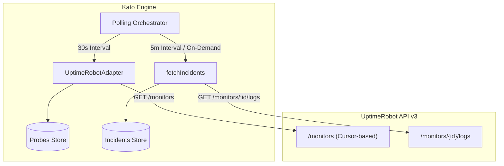

# UptimeRobot API v3 — Adapter Reference

This document provides the technical specification and implementation reference for the UptimeRobot adapter in the Kato Dashboard monitoring system.

---

## 1. Overview & Architecture

The UptimeRobot adapter (`uptime-robot.adapter.ts`) synchronizes UptimeRobot REST API v3 with Kato's unified data models (`NormalizedProbe`, `NormalizedIncident`).



---

## 2. Network Specifications & Authentication

### Base URL
```
https://api.uptimerobot.com/v3
```

### Authentication
API v3 relies on standard HTTP Bearer token authentication in request headers:

```http
Authorization: Bearer <api_key>
Content-Type: application/json
```

- **Key Nature**: API key generated from the UptimeRobot web console (*My Settings > API Settings*). Both Read-Only and Main API keys are accepted. The principle of least privilege strongly recommends using a **Read-Only API Key**.
- **Required Environment Variable**: `UPTIMEROBOT_API_KEY`
- **Optional Environment Variable**: `UPTIMEROBOT_POLL_INTERVAL` (ms, default: `30000`)

---

## 3. Quotas & Rate Limits

| Plan Tier | Allowed Request Quota | Kato Dashboard Recommendation |
|---|---|---|
| **FREE** | 10 requests / minute | Poll `GET /monitors` every **30s** (2 req/min) |
| **PRO** | `nb_monitors × 2` req / min (capped at 5,000 req/min) | Poll `GET /monitors` configurable at **10s–15s** |

> [!IMPORTANT]
> On the **FREE** tier, request budgeting prohibits per-monitor granular polling. Fetching the global inventory via `GET /monitors` consumes 2 req/min (at 30s intervals), leaving a safety margin of 8 req/min for ancillary lookups or background checks.

---

## 4. TypeScript Model Definitions

The adapter maps upstream monitors to the following normalized data structures:

```typescript
export type ProbeStatus = 'up' | 'down' | 'degraded' | 'paused' | 'pending';
export type ProbeCriticality = 'low' | 'medium' | 'high' | 'critical';

export interface NormalizedProbe {
  id: string;                      // Prefixed 'ur:{id}'
  name: string;                    // Extracted name (without group prefix)
  group: string | null;            // Category name or null
  url: string | null;              // Monitored target URL or IP
  status: ProbeStatus;             // Normalized status
  criticality: ProbeCriticality;   // Severity priority (default: 'medium')
  responseTime: number | null;     // Measured latency in ms
  uptime24h: number | null;        // 24h availability percentage
  uptime7d: number | null;         // 7-day availability percentage
  lastCheck: string;               // ISO 8601 UTC
}

export interface NormalizedIncident {
  id: string;                      // 'ur:inc:{monitorId}:{timestamp}'
  probeId: string;                 // 'ur:{monitorId}'
  probeName: string;
  type: 'down' | 'degraded';
  startedAt: string;               // ISO 8601 UTC
  resolvedAt: string | null;       // ISO 8601 UTC or null if ongoing
  duration: number | null;         // Duration in seconds
  cause?: string;                  // HTTP status code or reason text
}
```

---

## 5. API v3 Endpoints

### 5.1 GET `/monitors`
Retrieves the complete inventory of monitors configured with cursor-based pagination.

#### Query Parameters
| Parameter | Type | Required | Description |
|---|---|---|---|
| `cursor` | `string` | No | Opaque pagination cursor pointing to the next segment. |
| `per_page` | `number` | No | Items per page. Default: `50`, Maximum: `100`. |

#### Request Example
```http
GET /monitors?per_page=100 HTTP/1.1
Host: api.uptimerobot.com
Authorization: Bearer <UPTIMEROBOT_API_KEY>
Accept: application/json
```

#### Successful Response (200 OK)
```json
{
  "data": [
    {
      "id": 12345,
      "friendly_name": "[Core] API Production",
      "url": "https://api.example.com/health",
      "type": 1,
      "status": 2,
      "interval": 300,
      "create_datetime": "2024-01-15T10:00:00Z"
    },
    {
      "id": 12346,
      "friendly_name": "[DB] PostgreSQL Master",
      "url": "db.internal.example.com",
      "type": 4,
      "status": 9,
      "interval": 60,
      "create_datetime": "2024-02-01T08:30:00Z"
    }
  ],
  "pagination": {
    "next_cursor": "eyJpZCI6MTIzNDZ9",
    "has_more": false
  }
}
```

#### Monitor Types
| Code | Type | Technical Description |
|---|---|---|
| `1` | **HTTP(s)** | HTTP/HTTPS request with return code validation |
| `2` | **Keyword** | Checks presence/absence of string in HTTP body |
| `3` | **Ping** | ICMP echo request |
| `4` | **Port** | TCP socket open test (e.g. 5432, 3306, 22) |
| `5` | **Heartbeat** | Passive probe awaiting regular ping (Dead Man's Switch) |

#### Monitor Statuses & Kato Mapping
| UR Code | UptimeRobot Label | Kato Status | Description & Rationale |
|---|---|---|---|
| `0` | **Paused** | `paused` | Monitoring intentionally paused. |
| `1` | **Not checked yet** | `pending` | Monitor initialized, first check pending. |
| `2` | **Up** | `up` | Check succeeded with status 2xx/3xx. |
| `8` | **Seems down** | `degraded` | First failure observed, awaiting verification before declaring outage. |
| `9` | **Down** | `down` | Outage confirmed across verification nodes. |

---

### 5.2 GET `/monitors/{id}/logs`
Fetches chronological event log of status transitions (outages, recoveries, pauses).

#### Request Example
```http
GET /monitors/12345/logs HTTP/1.1
Host: api.uptimerobot.com
Authorization: Bearer <UPTIMEROBOT_API_KEY>
Accept: application/json
```

#### Response Example (200 OK)
```json
{
  "data": [
    {
      "type": 1,
      "datetime": "2024-01-15T10:30:00Z",
      "duration": 120,
      "reason": {
        "code": "503",
        "detail": "Service Unavailable"
      }
    },
    {
      "type": 2,
      "datetime": "2024-01-15T10:32:00Z",
      "duration": 0,
      "reason": {
        "code": "200",
        "detail": "OK"
      }
    }
  ]
}
```

---

## 6. Adapter Implementation Guide

The `UptimeRobotAdapter` class implements `MonitoringAdapter`.

### Key Design Decisions

1. **Name & Group Parsing**:
   - Parses the naming pattern `"[GroupName] MonitorName"`.
   - If regex `/^\[(.*?)\]\s*(.*)$/` matches, `group = $1` and `name = $2`.
   - Otherwise, `group = null` and `name = monitor.friendly_name`.
2. **Isolation of `fetchIncidents`**:
   - Querying `/monitors/{id}/logs` requires individual requests per monitor.
   - It is never executed in the fast 30s probe loop. Instead, it runs on demand when an operator inspects probe history or in a slower secondary loop.
3. **Resilience**:
   - Network timeouts (>10s) trigger one immediate retry before logging failure.
   - Rate limit responses (`HTTP 429`) trigger exponential backoff.
   - Server state in RAM is preserved even during provider network interruptions.

---

## 7. Error Handling Matrix

| Error Scenario | Adapter Behavior | Dashboard Impact |
|---|---|---|
| **401 Unauthorized** | Logs error. Does not crash server process. | Notifies operators that provider API key is invalid or revoked. |
| **429 Rate Limited** | Exponential backoff (60s, 120s, 240s) before re-attempting. | Preserves previous in-memory state. |
| **Timeout (>10s)** | Automatic single retry. If second attempt times out, skips cycle. | Retains last known state with freshness warning. |
| **Network Outage / DNS Failure** | Retains in-memory cache. | Existing probes remain visible with stale indicator. |

---

## 8. Implementation & Validation Checklist

- [x] API key is loaded via `UPTIMEROBOT_API_KEY`.
- [x] HTTP header specifies `Authorization: Bearer <token>`.
- [x] `GET /monitors` pagination handles `pagination.has_more` and `pagination.next_cursor`.
- [x] Normalized probe ID uses `ur:` prefix.
- [x] `[Group] Name` convention is supported.
- [x] Status code 8 maps to `degraded` rather than `down`.
- [x] `fetchIncidents` is isolated from the 30s regular probe poll.
- [x] 401, 429, and network error handling ensures continuous operation without crashing.
